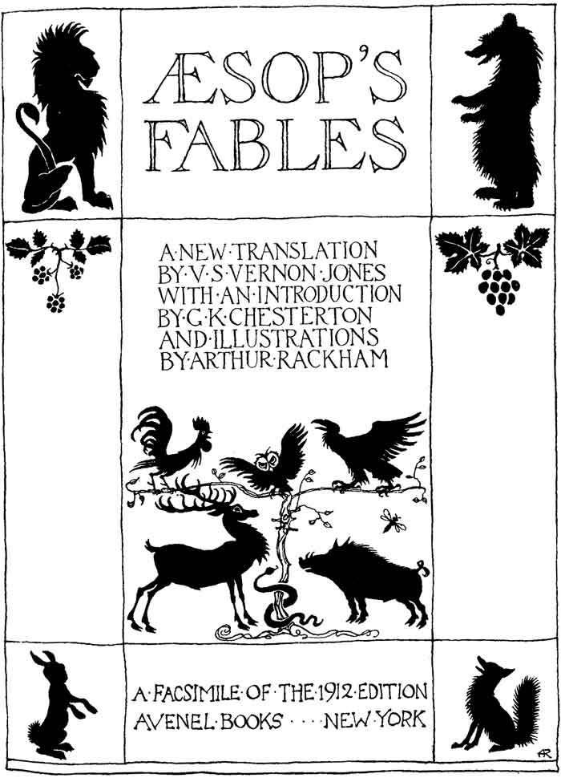

# AESOP'S FABLES

## A NEW TRANSLATION BY V. S. VERNON JONES

### WITH AN INTRODUCTION BY G. K. CHESTERTON AND ILLUSTRATIONS BY ARTHUR RACKHAM

1912 EDITION


  <article>
    <a href="{{ fable.url | prepend: site.baseurl }}">{{ fable.title }}</a>
    {{ fable.moral }}
  </article>


